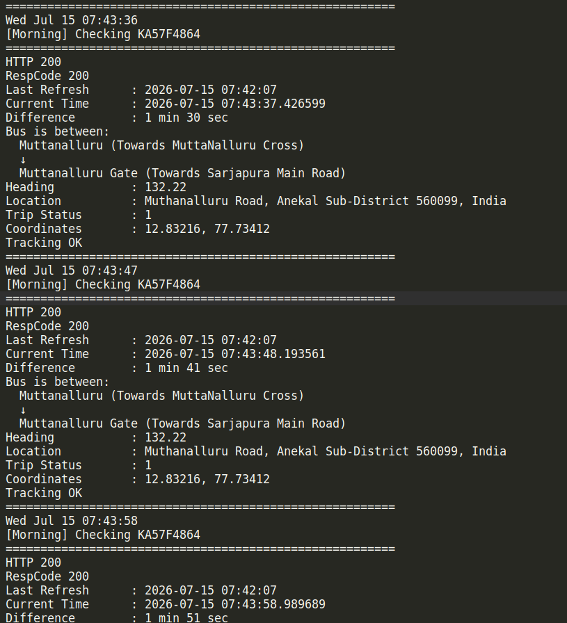
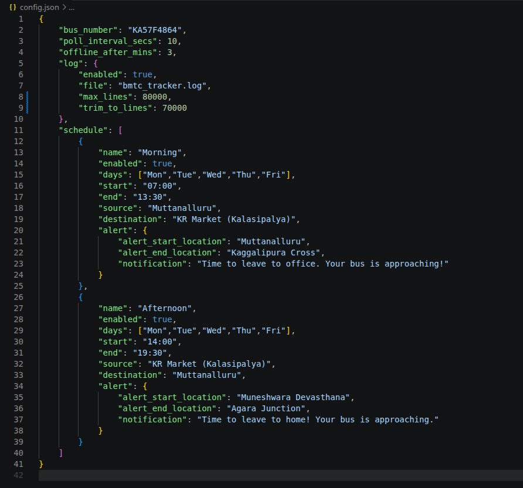

# BMTC Bus Tracker

A lightweight Python utility to monitor BMTC buses in real time using BMTC's internal APIs.

## Features

- Live bus tracking
- Offline tracking notifications
- Schedule-based monitoring
- Travel alerts for daily commute
- Route verification using GPS (Shapely)
- Configurable JSON-based settings

## Configuration

Edit `config.json` to configure:

- Bus number
- Monitoring schedule
- Travel alerts
- Notification settings
- Logging

## Screenshot

**Live Tracking**



**Configuration**



## Requirements

- Python 3.10+
- `requests`
- `shapely`

Install dependencies:

```bash
pip install requests shapely
```

## License

Released under the MIT License.

Feel free to use, modify, and share this project.
